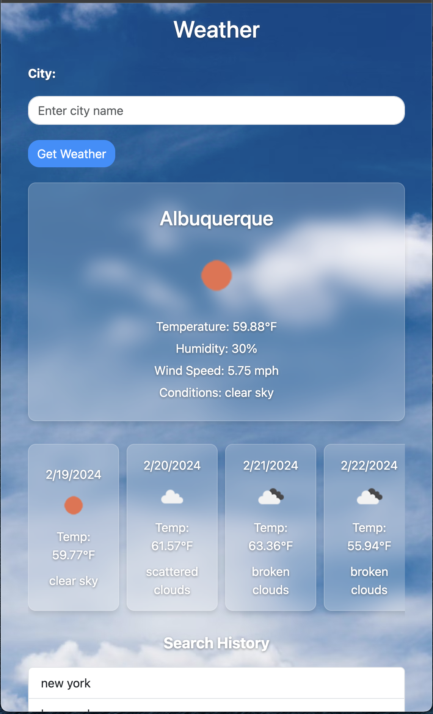

# React Weather Dashboard

## Description

The React Weather Dashboard is a sleek, user-friendly web application that provides real-time weather information, including forecasts, humidity, wind speed, and atmospheric conditions. Utilizing data from the OpenWeatherMap API, this dashboard offers an intuitive interface for users to search for and display weather data for cities worldwide. Designed with responsiveness in mind, it ensures an optimal viewing experience across a wide range of devices.

Check out the App here: [Weather Dashboard](https://jordanolguin.github.io/ReactWeatherDashboard/)



## Features

- **Live Weather Data**: Displays current weather conditions, including temperature, humidity, and wind speed.
- **Forecast**: Access to a 5-day weather forecast with daily summaries.
- **Search Functionality**: Users can search for cities globally to retrieve weather information.
- **Search History**: Provides a clickable history of searched cities for quick access to previous searches.
- **Responsive Design**: Ensures a consistent experience across various devices and screen sizes.
- **Glassmorphism UI**: Modern UI design employing glassmorphism for a visually appealing interface.

## Technology Stack

- **React**: A JavaScript library for building user interfaces.
- **Bootstrap & React-Bootstrap**: For styling and responsive design.
- **Axios**: Promise-based HTTP client for making API requests.
- **OpenWeatherMap API**: Source of real-time weather data.

## Installation

Ensure you have [Node.js](https://nodejs.org/) installed on your system to use npm (Node Package Manager).

1. Clone the repository:
   ```bash
   git clone git@github.com:jordanolguin/ReactWeatherDashboard.git
   ```
2. Navigate to the project directory:
   ```bash
   cd weather-app
   ```
3. Install dependencies:
   ```bash
   npm install
   ```
4. Create a `.env` file in the root directory and add your OpenWeatherMap API key:
   ```plaintext
   REACT_APP_WEATHER_API_KEY=your_api_key_here
   ```
5. Run the application:
   ```bash
   npm start
   ```

The application will be available at `http://localhost:3000`.

## Usage

- **Search for a City**: Enter the name of the city in the search bar and press enter or click the "Get Weather" button.
- **View Weather Data**: Current weather conditions and a 5-day forecast will be displayed.
- **Access Search History**: Click on a city name in the search history panel to quickly retrieve weather data for that location.

## Contributing

Contributions to the React Weather Dashboard are welcome! Please follow these steps:

1. Fork the repository.
2. Create a new branch: `git checkout -b feature-branch-name`.
3. Make your changes and commit them: `git commit -am 'Add some feature'`.
4. Push to the branch: `git push origin feature-branch-name`.
5. Submit a pull request.

Please ensure your code adheres to the project's coding standards and include tests for new features or bug fixes.

## License

This project is licensed under the MIT License - see the [LICENSE.md](LICENSE.md) file for details.

## Acknowledgments

- [OpenWeatherMap](https://openweathermap.org/) for providing the weather data API.
- All contributors who have helped to improve the React Weather Dashboard.
